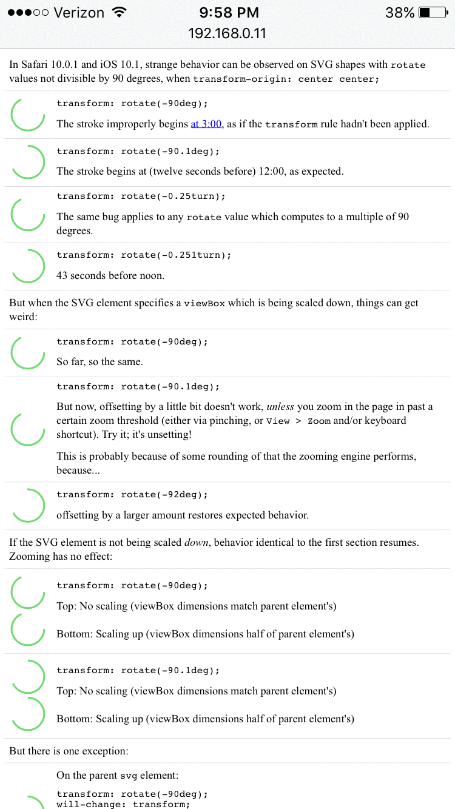
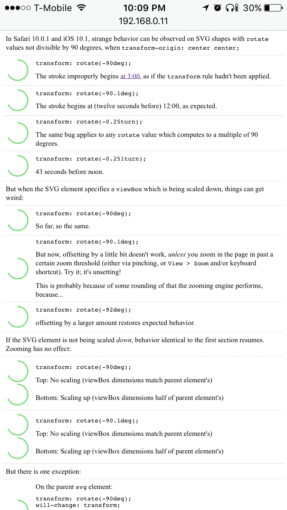
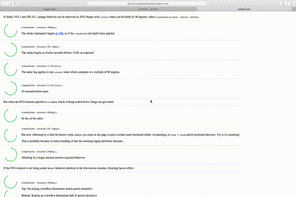

In iOS 10.1 and Safari 10.0.1 (and as far as I can tell _only_ on iOS 10.1 and Safari 10.0.1) I've found a strange stinkbug invoving rotation of SVG elements. The bug is triggered by any rotate value which computes to a value divisible by 90 degrees.

But it gets weirder.

To experience, load circles.html in Safari 10.0.1 or iOS 10.1, read along, and start zooming. Tweet me and/or pull request if you notice it in any other iOS or Safari builds.

### Proof

#### Happening in iOS 10.1 Safari:

#### Not happening in iOS 10.2 Public Beta 2:

#### Happening in Safari 10.0.1

(on macOS 10.12.2 Beta)

